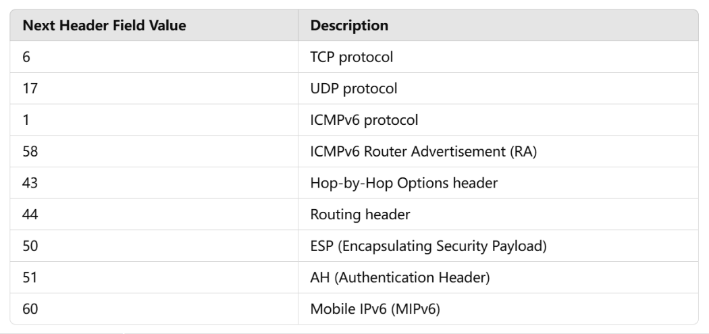
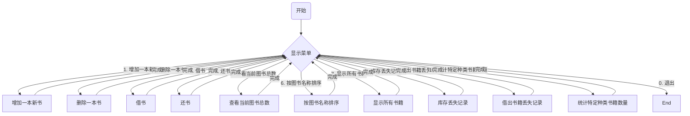

# 文件夹名为取到特定的值收集到的报文

| 字段值 | 描述                                  |
| ------ | :------------------------------------ |
| 0      | Hop-by-Hop Options Header             |
| 43     | Routing Header                        |
| 44     | Fragment Header                       |
| 60     | Destination Options Header            |
| 51     | Authentication Header                 |
| 50     | Encapsulating security Payload Header |
| 59     | No Next Header                        |
| 6      | TCP                                   |
| 17     | UDP                                   |
| 58     | ICMPv6                                |

| NH字段的值 |                    描述                    |
| :--------: | :----------------------------------------: |
|            |           Extension Header Order           |
|            |                  Options                   |
|            |         Hop-by-Hop Options Header          |
|            |               Routing Header               |
|            |              Fragment Header               |
|            |         Destination Options Header         |
|            |               No Next Header               |
|            | Defining New Extension Headers and Options |
|            |                    TCP                     |
|            |                    UDP                     |
|            |                    ICMP                    |

